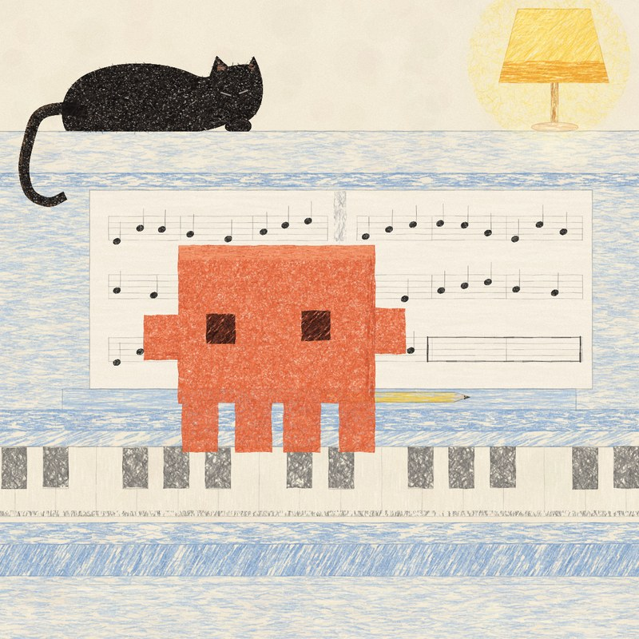

# Pencil Piano Cat



One still frame from [Kevin Ngo's piano animation](https://x.com/kevin_t_ngo/status/2103482164193165711), recreated by hand in plain JavaScript on a `<canvas>`. There are no images and no libraries in the drawing. Every colored area is thousands of short pencil strokes, with a paper-grain mask knocked out of them so the cream paper shows through.

This repo holds the drawing and the workflow used to make it, so you can recreate a frame of your own the same way.

## Try it

Open `index.html` in a browser. Press **Redraw strokes** to roll a new set of pencil strokes, or add `?seed=42` to the URL to pick one.

## Setup for the scripts

The scripts drive a headless Chromium through Playwright. You need Node 18 or newer.

```sh
npm install
npx playwright install chromium
```

If you already have Chromium somewhere, skip the second line and point the scripts at it with `CHROMIUM_PATH=/path/to/chromium`.

| Command | What it does |
| --- | --- |
| `npm run crop -- --in shot.jpg --rect x,y,w,h` | Cuts the frame out of a screenshot into `reference/ref.png` |
| `npm run render` | Draws the scene and saves `out/render.png` |
| `npm run compare` | Saves the reference and your render side by side in `out/compare.png`, and prints color distances for the regions in `reference/points.json` |
| `npm run compare -- --crop x,y,w,h` | Same, zoomed on one area, into `out/compare-crop.png` |

The reference image is not in the repo because it is someone else's artwork. Make your own copy with step 1 below.

## Recreate a frame yourself

This is the loop that produced the drawing. It took five rounds of compare and fix to get from a first pass to the image above.

### 1. Get the reference frame

Pause the video and take a screenshot. Open it in any image viewer and read off the frame's top-left corner, width and height in pixels. Then crop it:

```sh
npm run crop -- --in screenshot.jpg --rect 44,912,1177,1176
```

### 2. Measure the layout

Make the canvas the same size as the reference (here 1176 × 1176) so you can copy coordinates straight off the image. Write down the box of every object: the piano bands, the sheet music, the keys, the cat, the lamp. Sample a few colors while you are there. Repeating things are worth measuring once and computing: the black keys here repeat every 525 px in groups of two and three.

### 3. Draw back to front

Start a scene file next to `src/piano-cat.js` and use the toolkit in `src/pencil.js`. Paint in the order things overlap: paper, glow, big background bands, then objects, then the things in front, and a final grain pass. `draw()` at the bottom of `piano-cat.js` shows the order used here.

Get everything on the canvas roughly first. Placement matters more than texture on the first pass.

### 4. Compare

```sh
npm run compare
npm run compare -- --crop 0,60,500,500
```

Look at the full side by side for layout and overall color, then zoom into one area at a time for texture. Edit `reference/points.json` to measure the regions you care about. The table lists the worst match first, and a distance under about 15 is hard to see.

### 5. Fix the worst thing and repeat

These were the fixes that mattered most, in the order they came up:

| What looked wrong | What fixed it |
| --- | --- |
| Blue areas looked like long hairline streaks | Shorter strokes (`len: [10, 34]`), wider (`width: [1.4, 3]`), more angle wobble (`angleVar: 0.22`) |
| Colors too saturated or too dark | Lower `alpha` and `density` before touching the color itself |
| Fill looked flat, like a digital fill | Raise `tooth` so more paper shows through |
| Cross-hatching visible in the orange | Short strokes at random angles (`angleVar: 1.4`) with high `density` |
| Black cat came out grey | A solid dark base under the strokes, then thousands of 1 px cream specks on top |
| Sheet music tinted blue by the panel behind it | An opaque paper fill before the pencil texture |
| Crisp black note heads | Draw them with `crayon` too, so they get grain like everything else |

Stop when the side by side reads the same at a glance and the zoomed crops have the same texture.

## The toolkit

`createPencil(canvas)` in `src/pencil.js` returns these helpers. They all share one seeded random generator, so the same seed and the same call order give the same picture pixel for pixel.

- `reset(seed)` re-seeds and rebuilds the paper-tooth mask. Call it at the start of every draw.
- `crayon(shape, box, opts)` fills `shape` (a function that adds a path to a context) with strokes scattered over `box` (`[x, y, w, h]`).
- `pline(x1, y1, x2, y2, opts)` draws a wobbly graphite line with broken pressure. Options are `color`, `width`, `alpha` and `passes`.
- `roughRect(x, y, w, h, jitter)` and `roughPoly(points, jitter)` give hand-drawn edges.
- `rand(a, b)`, `pick(array)` and `random()` use the seeded generator. Use them instead of `Math.random()` or the seed stops working.

`crayon` options:

| Option | Default | Meaning |
| --- | --- | --- |
| `color` / `colors` | `[0,0,0]` | One RGB color, or a list to pick from per stroke |
| `angle`, `angleVar` | `0`, `0.12` | Stroke direction in radians, and how much it wanders |
| `len`, `width` | `[20,60]`, `[1,2.2]` | Stroke length and thickness ranges in px |
| `alpha` | `[0.35,0.8]` | Opacity range per stroke |
| `density` | `1` | How many strokes; about 1 covers the area once |
| `tooth` | `0.6` | How much paper grain is knocked out afterwards, 0 to 1 |
| `light` | `10` | Random lightness shift per stroke |
| `curve` | `3` | How much each stroke bends |

## Files

```
index.html            the page
src/pencil.js         the pencil toolkit
src/piano-cat.js      the scene, measured off the reference
tools/                crop, render and compare scripts
reference/points.json regions the compare script measures
.claude/skills/       the same workflow written for Claude Code
```

## With Claude Code

`.claude/skills/recreate-frame/SKILL.md` describes this workflow for [Claude Code](https://claude.com/claude-code). Open the repo in Claude Code, attach a screenshot, and ask something like "Recreate this frame in JavaScript as closely as you can." It will crop the reference, build a new scene file with the toolkit, and run the compare loop until it matches.
